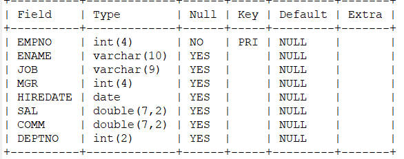
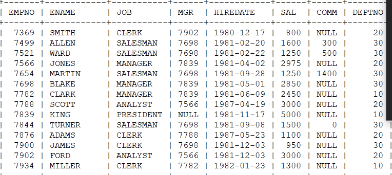
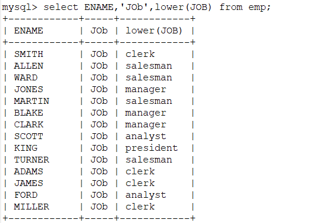
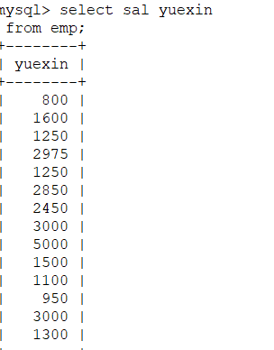
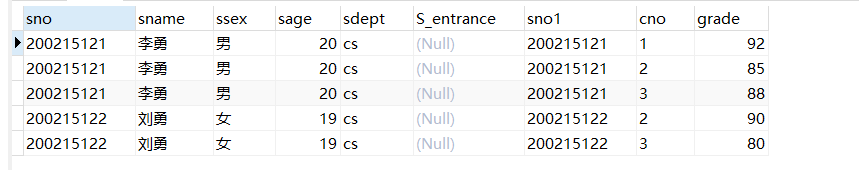
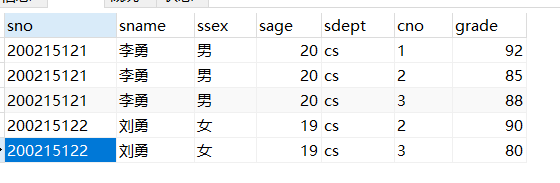
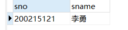
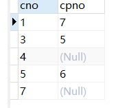
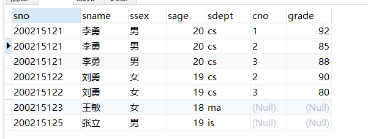
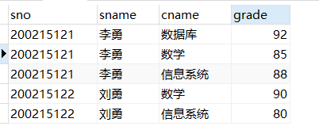

# MySQL相关


#### 启用服务 

net start /stop 服务名

#### 登录MySql

### 命令

show databases;

### 表 

---

**表为demo1**

行row  列col

#### 数据类型


#### 创建一个表

 ```SQL
 create table wodemo(
 id char(10),
 
  title char(4),
 
  author char(4),
 
  sub_data data,
 
  primary key(id)
 
  ); 
 ```


#### 显示一个表中各个字段名

`show columns from  表名` 



#### 显示表中所有数据

`select * from 表名`



字段名与可以与字符拼接输出

 ```sql
 select col_name,'字符串'，low(col_name)
 ```




#### 指定改变查询结果的列标题

 ```sql
 select col_title change_title 
 from table;
 ```




#### orderby语句

 ```sql
 select col_title 
 from table_name
 order by col_title [desc] --升序asc 降序 desc
 ```


#### 消除结果表中的重复行

 ```sql
 select distinct col_name --去重
 from table_name;
 
 ```


#### 查询满足条件的元组

 ```SQL
 select col_name
 from table_name
 where conditon--输入条件 ;
 ```


1. 比较大小

 ```sql
 select ename 
 from emp
 where sal>=3000;   
 ```


 2. 确定范围

   ```sql
   select sal
   from emp
   where sal between 1100 and 3000-- 包括上下限的 --
   order by sal desc;
   ```


3. 确定集合

   ```sql
   select ename
   from emp
   where job in('manager'); 
   ```


** in的相对谓词是not in**

 4. 字符匹配

like后一种不含通配符可以用=代替，另一种含有通配符

like的相对谓词

   ```sql
   select ename
   from emp
   where ename like 'm%';
   -- ASCII中一个汉字一个_
       GBK一个汉字一个__ --
        
   ```


** 通配符的转义**

 ```sql
 where sname like'db\_design' escape'\';--对\后的_不再有通配符的含义 
 ```


  5. 查询空值

   ```sql
   select ename
   from emp
   where comm is not null; 
   ```


 6. 多重条件查询

   ```sql
   select ename
   from emp
   where hiredate like '1981%' and sal>2000;
   ```


#### 聚集函数

  1. 统计元组个数→就是多少行

     ```sql
     select count(ename)
     from emp; 
     ```


  2. 统计一列中值的个数

     ```sql
     select count (distinct sal)
     from emp; 
     ```


  3. 统计一列中不重复的个数

     ```sql
     select count(distinct 'eptno');
     from emp; 
     ```


  4. 求一列元素的平均值、总值、最大值、最小值

     ```sql
     select max(sal)
     from emp; 
     ```


#### group by字句

   ```sql
   select job,count(*)
   from emp
   group by job;
   --来统计每一分类的 对job分类，统计相应工作的人数
   ```


#### 连接查询→设计两个表的查询→为书上的表

 ```sql
 select student.*,sc.*
 from student,sc
 where student.sno=sc.sno 
 ```




#### 嵌套循环思想：

从一张表中的找到第一个元组，然后从头到尾扫描另一种表，若有相同的属性，则输出，接着扫描下一个元素，直到另一张表扫描完成后，找该表的第一个元组。

 ```sql
 SELECT student.sno,sname,ssex,sage,sdept,cno,grade
 FROM student,sc
 WHERE student.sno=sc.sno
 ```




一条SQL语句可以同时完成选择和连接查询，where字句是由连接谓词和选择谓词组成的复合条件

   ```sql
   SELECT student.sno,sname
   FROM student,sc
   WHERE student.sno=sc.sno AND
   sc.cno='2' AND sc.grade<90
   ```




#### 自身连接→自己与自己连接

问题引入→查找先修课程的先修课程

 ```sql
 SELECT FIRST.cno,SECOND.cpno
 FROM course FIRST,course SECOND
 WHERE FIRST.cpno=SECOND.cno -- 书上的两个表做自然连接
 ```




#### 外连接

   ```sql
   SELECT student.sno,sname,ssex,sage,sdept,cno,grade
   FROM student LEFT OUTER JOIN sc on(student.sno=sc.sno)--列出student中所有的元组
   ```




#### 多表连接

 ```sql
 select student.sno,sname,cname,grade
 FROM student,sc,course
 WHERE student.sno=sc.sno AND sc.cno=course.cno 
 ```




### 嵌套查询

